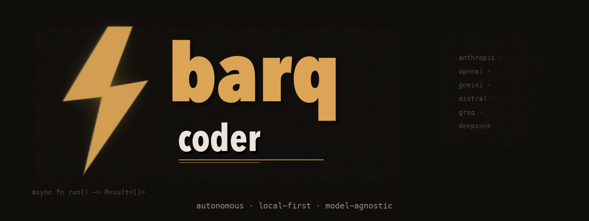
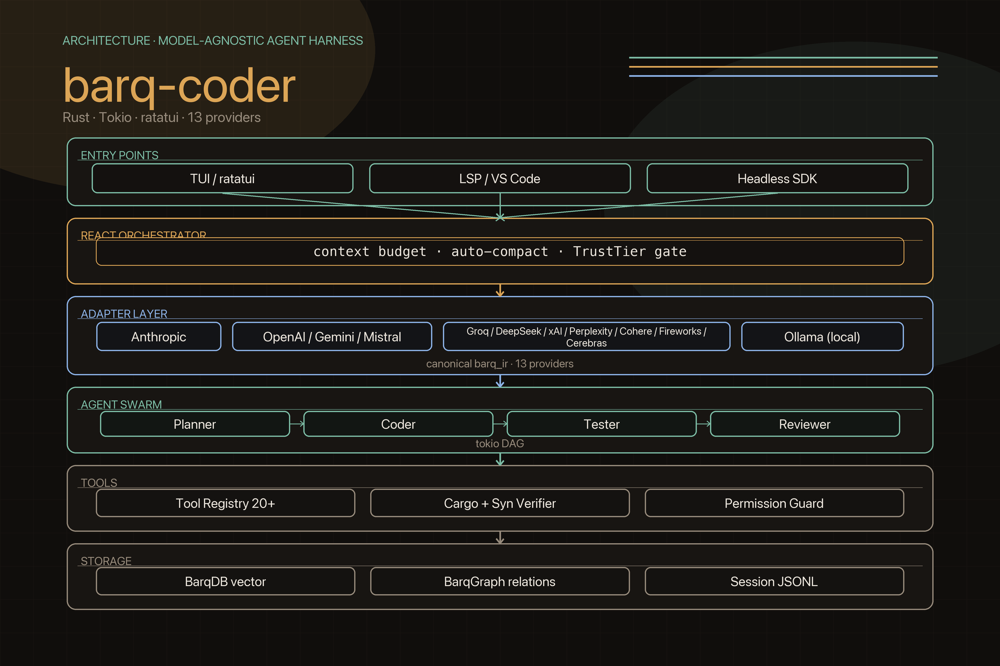

<div align="center">



[](https://www.rust-lang.org)
[](LICENSE)
[](#providers)
[](#installation)

**Autonomous · Local-first · Model-agnostic**

</div>

---

**barq-coder** is an autonomous AI coding agent built in Rust. It combines a streaming ReAct orchestrator, semantic code indexing, a multi-agent swarm, and a rich terminal UI — running entirely on your machine with your choice of model.

```
barqcoder --workspace ./my-project
> Add a JWT authentication middleware with tests
```

---

## Architecture



barq-coder is built as a layered stack:

| Layer | What it does |
|---|---|
| **Entry Points** | TUI (ratatui), LSP (VS Code extension), Headless/SDK |
| **ReAct Orchestrator** | Streaming agent loop, context budget, TrustTier gate |
| **Adapter Layer** | Provider-agnostic `ProviderAdapter` trait → canonical `barq_ir` IR |
| **Agent Swarm** | Planner → Coder → Tester → Reviewer, tokio DAG |
| **Tools** | 20+ tools, Cargo/Syn verification, permission guard |
| **Storage** | BarqDB (vector), BarqGraph (relations), Session JSONL |

---

## Providers

barq-coder supports **13 providers** out of the box. Switch with `BARQ_PROVIDER` or `provider = "..."` in `Config.toml`.

| Provider | `BARQ_PROVIDER` | Default model | API key env var |
|---|---|---|---|
| **Ollama** (local) | `ollama` | `minimax-m2.7:cloud` | — |
| **OpenAI** | `openai` | `gpt-4o` | `OPENAI_API_KEY` |
| **Anthropic** | `anthropic` | `claude-sonnet-4-6` | `ANTHROPIC_API_KEY` |
| **Google Gemini** | `gemini` | `gemini-2.5-pro` | `GEMINI_API_KEY` |
| **Mistral AI** | `mistral` | `mistral-large-latest` | `MISTRAL_API_KEY` |
| **Groq** | `groq` | `llama-3.3-70b-versatile` | `GROQ_API_KEY` |
| **Together AI** | `together` | `meta-llama/Llama-3.3-70B-Instruct-Turbo` | `TOGETHER_API_KEY` |
| **DeepSeek** | `deepseek` | `deepseek-chat` | `DEEPSEEK_API_KEY` |
| **xAI Grok** | `xai` | `grok-3-latest` | `XAI_API_KEY` |
| **Perplexity** | `perplexity` | `sonar-pro` | `PERPLEXITY_API_KEY` |
| **Cohere** | `cohere` | `command-r-plus` | `COHERE_API_KEY` |
| **Fireworks AI** | `fireworks` | `llama-v3p3-70b-instruct` | `FIREWORKS_API_KEY` |
| **Cerebras** | `cerebras` | `llama3.1-70b` | `CEREBRAS_API_KEY` |

Per-model capability overrides (vision, reasoning, context window, tool support) are resolved automatically via the built-in `CapabilityRegistry` and can be further patched in `Config.toml`.

---


## Key Features

**Autonomous Agent Loop**
A streaming ReAct orchestrator calls the active provider, parses tool invocations, executes them, and feeds results back — looping until a final answer is reached. Context is automatically compacted when the token budget is exceeded.

**Multi-Agent Swarm**
Complex goals are decomposed by a `PlannerAgent` into a dependency DAG. Steps whose dependencies are satisfied are launched concurrently via `tokio::spawn` + `FuturesUnordered`. `CoderAgent`, `TesterAgent`, and `ReviewerAgent` each run independently with their own LLM context.

**Semantic Code Index (BarqDB)**
Workspace files are indexed into a vector database for semantic search. The orchestrator automatically injects relevant code snippets into the system prompt before each turn.

**TrustTier Gate**
Every tool call is checked against the active provider's `TrustTier` (ReadOnly / CodeModify / Shell / Full) before any session-level allow rules are consulted. This boundary cannot be bypassed by interactive approvals.

**Permission System**
Destructive operations pause the agent and prompt the user interactively in the TUI. `[Y]` approves once, `[A]` remembers the scope, `[N]` denies. CI environments can bypass with `--dangerously-skip-permissions`.

**Capability Registry**
Three-layer resolution — provider default → built-in model knowledge → user `Config.toml` overrides — so vision, reasoning, context size, and tool support are always correct for the active model without manual configuration.

**Project Memory**
Agent instructions are persisted in `.barqcoder.md` at the workspace root and injected into every system prompt.

**Session Persistence**
Sessions are stored as append-only JSONL files. Resume with `--continue` or `--resume <id>`.

**Headless / SDK Mode**
Run a single prompt without the TUI and pipe the output:
```bash
barqcoder print "refactor the auth module" --json | jq .response
```

**VS Code + LSP**
A Language Server Protocol implementation is included. Launch with `barqcoder --lsp` and configure the provided VS Code extension.

---

## Installation

**Prerequisites:** [Rust](https://rustup.rs) 1.75+, [Ollama](https://ollama.com) (optional, for local models)

```bash
git clone https://github.com/YASSERRMD/barq-coder
cd barq-coder
cargo build --release
cp target/release/barqcoder /usr/local/bin/
```

Verify the setup:
```bash
barqcoder doctor
```

---

## Configuration

On first run, barq-coder reads `Config.toml` from the current directory, falling back to built-in defaults.

```toml
# Config.toml

# Local Ollama (default)
provider         = "ollama"
ollama_base_url  = "http://localhost:11434"
ollama_model     = "qwen2.5-coder:7b"

# Or switch to a cloud provider:
# provider = "anthropic"
# anthropic_model = "claude-sonnet-4-6"

workspace_root  = "./"
max_iterations  = 10
token_limit     = 32768

# Per-model capability patches (optional):
# [model_capability_overrides."ollama:llava:13b"]
# supports_vision = true
#
# [model_capability_overrides."openai:o3-mini"]
# supports_reasoning = true
# supports_system_message = false
```

All values can be overridden via environment variables (`BARQ_PROVIDER`, `OPENAI_API_KEY`, `ANTHROPIC_API_KEY`, …).

---

## Usage

### Interactive mode (default)

```bash
barqcoder                           # TUI with default config
barqcoder --workspace ./my-project  # specify workspace
barqcoder --model qwen2.5-coder:14b # override model
barqcoder --continue                # resume last session
barqcoder --resume session_1712345  # resume specific session
```

### Headless mode

```bash
barqcoder print "add error handling to the database layer"
barqcoder print "explain the auth flow" --json
```

### Subcommands

| Command | Description |
|---|---|
| `barqcoder index [path]` | Index a directory into BarqDB |
| `barqcoder sessions` | List saved sessions |
| `barqcoder sessions --show <id>` | Replay a session's events |
| `barqcoder memory` | Show project memory |
| `barqcoder memory --add "always use anyhow for errors"` | Add a memory entry |
| `barqcoder doctor` | Check provider connectivity |

### Slash commands (inside TUI)

| Command | Description |
|---|---|
| `/compact` | Compress conversation history to reclaim context |
| `/plan` | Enter plan mode — agent outlines steps before acting |
| `/review` | Show all file edits made this session |
| `/memory [show]` | Display project memory |
| `/memory add <note>` | Add a note to `.barqcoder.md` |
| `/model <name>` | Switch the active model mid-session |
| `/status` | Show token usage, turn count, tool calls |
| `/goal <text>` | Dispatch a goal to the full multi-agent swarm |
| `/clear` | Clear chat history and conversation context |
| `/help` | List all commands and key bindings |

---

## TUI Key Bindings

| Key | Action |
|---|---|
| `Enter` | Send message |
| `↑ / ↓` | Navigate input history |
| `PageUp / PageDown` | Scroll chat |
| `Tab / Shift+Tab` | Switch tabs (Chat / Diff / Sessions) |
| `Alt+S` | Toggle file sidebar |
| `F1` | Focus sidebar |
| `Y / A / N` | Approve once, remember, or deny a tool permission request |
| `Esc` | Quit |

---

## Tool Registry

| Tool | Description |
|---|---|
| `read_file` | Read a file with optional line range |
| `edit_file` | Apply string-replace or unified diff edits |
| `create_file` | Create a new file |
| `list_files` | List directory contents |
| `glob` | Search files by path pattern |
| `grep` | Search file contents (ripgrep-accelerated) |
| `shell` | Execute shell commands |
| `git` | Run git operations |
| `cargo_check` | Build and type-check Rust projects |
| `web_fetch` | Fetch and extract text from a URL |
| `barq_search` | Semantic code search across the indexed workspace |
| `delegate_task` | Dispatch a goal to the multi-agent swarm |
| `file_history` | Undo/redo file edits |
| `notebook_edit` | Edit Jupyter Notebook (.ipynb) cells |
| `python_repl` | Execute inline Python code (REPL) |

---

## Recommended Models

### Local (Ollama)

| Model | Size | Strength |
|---|---|---|
| `qwen2.5-coder:7b` | 4.7 GB | General coding, fast |
| `qwen2.5-coder:14b` | 9.0 GB | Higher accuracy |
| `deepseek-coder-v2` | 8.9 GB | Strong reasoning |
| `codellama:13b` | 7.4 GB | Function calling |

Pull a model: `ollama pull qwen2.5-coder:7b`

### Cloud

| Provider | Model | Strength |
|---|---|---|
| Anthropic | `claude-sonnet-4-6` | Best all-round coding |
| OpenAI | `gpt-4o` | Strong tool use, vision |
| Gemini | `gemini-2.5-pro` | 2M context, reasoning |
| Groq | `llama-3.3-70b-versatile` | Ultra-fast inference |
| DeepSeek | `deepseek-chat` | Cost-effective, strong |

---

## Project Memory

Create `.barqcoder.md` at the root of your workspace. Its contents are injected into every system prompt:

```markdown
# My Project

- This is a Rust/Axum backend. Prefer anyhow for error handling.
- Always write integration tests for new endpoints.
- Database migrations use sqlx and live in `migrations/`.
```

Add notes interactively: `/memory add always use snake_case for DB columns`

---

## Containerization (Docker)

```bash
docker pull barqcoder:latest
# or build locally:
docker build -t barqcoder:local .

docker run -it --rm \
  --network host \
  -v $(pwd):/workspace \
  barqcoder:local --workspace /workspace
```

---

## CI / Production

```yaml
- name: Review Code
  run: |
    BARQ_PROVIDER=openai OPENAI_API_KEY=${{ secrets.OPENAI_API_KEY }} \
    barqcoder print "Review the latest changes and suggest optimizations" \
      --dangerously-skip-permissions \
      --workspace .
```

---

## License

MIT License. See [LICENSE](LICENSE).
