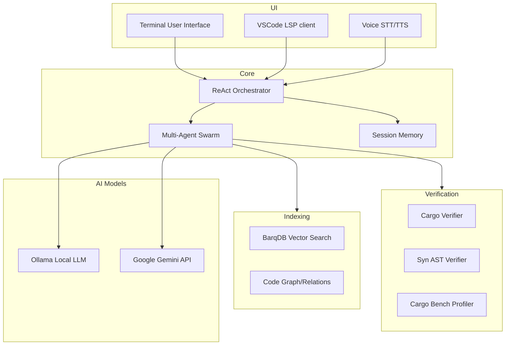

# Architecture Diagram

```mermaid
graph TD;
    subgraph UI
        TUI[Terminal User Interface]
        LSP[VSCode LSP client]
        Voice[Voice STT/TTS]
    end

    subgraph Core
        Orchestrator[ReAct Orchestrator]
        Agents[Multi-Agent Swarm]
        Session[Session Memory]
    end

    subgraph Verification
        CargoCheck[Cargo Verifier]
        Symbolic[Syn AST Verifier]
        Perf[Cargo Bench Profiler]
    end

    subgraph Indexing
        BarqDB[BarqDB Vector Search]
        GraphDB[Code Graph/Relations]
    end

    subgraph AI Models
        Ollama[Ollama Local LLM]
        Gemini[Google Gemini API]
    end

    TUI --> Orchestrator
    LSP --> Orchestrator
    Voice --> Orchestrator
    
    Orchestrator --> Agents
    Orchestrator --> Session
    
    Agents --> Verification
    Agents --> Indexing
    Agents --> Ollama
    Agents --> Gemini
```
